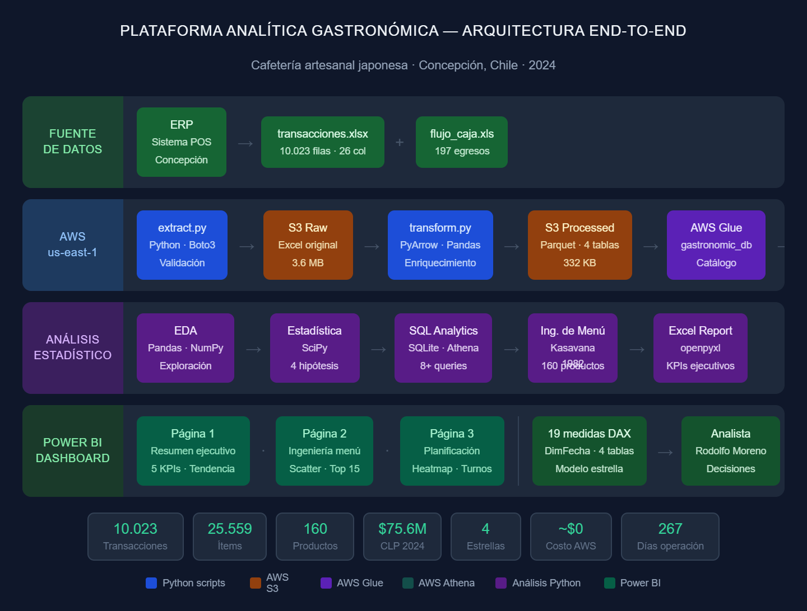

# Plataforma Analítica Gastronómica — Caso de Estudio Integral

## Resumen ejecutivo

Diseño e implementación de una plataforma analítica end-to-end 
para una cafetería  japonesa en Concepción, Chile, 
procesando 10.023 transacciones reales del ERP del negocio.

La plataforma transforma datos crudos del sistema de punto de 
venta en insights accionables mediante una arquitectura cloud 
en AWS, análisis estadístico inferencial e Ingeniería de Menú 
(Kasavana & Smith, 1982), visualizados en un dashboard ejecutivo 
interactivo en Power BI.

**Resultado:** identificación de oportunidades de optimización 
de margen en el 83% de los ingresos del negocio.

---

## Planteamiento del problema

Una cafetería artesanal japonesa con operación diaria en 
Concepción, Chile enfrentaba 4 problemas críticos:

**1. Datos fragmentados:** las ventas vivían en el ERP sin 
posibilidad de análisis histórico ni comparativo.

**2. Sin visibilidad de rentabilidad por producto:** el dueño 
no sabía cuáles productos realmente generaban margen y cuáles 
consumían recursos sin retorno.

**3. Decisiones operacionales reactivas:** la producción diaria 
y gestión de recursos humanos se decidía por intuición, no por datos.

**4. Sin infraestructura analítica:** no existía un pipeline 
que moviera los datos del ERP hacia un entorno de análisis.

---

## La solución

Construcción de una plataforma analítica de 4 capas:

~~~
CAPA 1 — DATOS FUENTE
ERP (Excel) → 10.023 transacciones · 25.559 ítems · 160 productos

CAPA 2 — INGENIERÍA DE DATOS (AWS)
Python → S3 Raw → S3 Staging → S3 Processed (Parquet)
→ AWS Glue Catalog → AWS Athena

CAPA 3 — ANÁLISIS
EDA · Estadística inferencial · Ingeniería de Menú (Kasavana & Smith)
4 hipótesis validadas · 157 productos clasificados

CAPA 4 — VISUALIZACIÓN
Power BI Dashboard · 3 páginas · 19 medidas DAX
KPIs ejecutivos · Matriz de menú · Planificación operacional
~~~

---

## Arquitectura completa

---

## Stack tecnológico completo

| Capa | Tecnología | Uso |
|---|---|---|
| Extracción | Python · Pandas · Boto3 | Lectura y validación del ERP |
| Almacenamiento | AWS S3 | 3 capas: Raw / Staging / Processed |
| Catálogo | AWS Glue | Esquema de 4 tablas |
| Consulta | AWS Athena · SQL | 8 queries analíticas |
| Formato | Apache Parquet · PyArrow | Almacenamiento columnar optimizado |
| Análisis | Python · SciPy · Statsmodels | Estadística inferencial |
| Menú | Kasavana & Smith (1982) | Clasificación de 160 productos |
| Visualización | Power BI · DAX | Dashboard ejecutivo 3 páginas |
| Control versiones | Git · GitHub | 4 repositorios públicos |

---

## Proyectos que componen la plataforma

### P1 — Análisis EDA y estadístico
**Repo:** [Coffe-ops-eda-analysis](https://github.com/rmoreno-dev/Coffe-ops-eda-analysis)

Análisis exploratorio completo con estadística inferencial e 
Ingeniería de Menú sobre 10.023 transacciones reales.

Tecnologías: Python · Pandas · SciPy · SQL · SQLite · Excel

### P2 — Pipeline de datos AWS
**Repo:** [aws-gastronomic-data-pipeline](https://github.com/rmoreno-dev/aws-gastronomic-data-pipeline)

Pipeline ETL completo con arquitectura de 3 capas en S3, 
catálogo Glue y análisis SQL en Athena.

Tecnologías: Python · Boto3 · AWS S3 · Glue · Athena · Parquet

### P3 — Dashboard Power BI
**Repo:** [gastronomic-powerbi-dashboard](https://github.com/rmoreno-dev/gastronomic-powerbi-dashboard)

Dashboard ejecutivo interactivo de 3 páginas con 19 medidas 
DAX y Matriz de Ingeniería de Menú visualizada.

Tecnologías: Power BI Desktop · DAX · CSV desde AWS S3

---

## Hallazgos principales

### Ingeniería de Menú (Kasavana & Smith, 1982)

| Clasificación | Productos | Ingresos | % total | Acción |
|---|---|---|---|---|
| Estrellas | 4 | $3,492,000 | 4.8% | Proteger y promover |
| Caballos de Trabajo | 44 | $60,373,727 | 83.0% | Auditar costos |
| Interrogantes | 30 | $4,175,320 | 5.7% | Reposicionar |
| Perros | 85 | $4,676,095 | 6.4% | Evaluar retiro |

**Hallazgo crítico:** el Pan dulce relleno con diseño 
representa el 12.83% del mix de ventas pero clasifica como 
Caballo de Trabajo — oportunidad de mejora de margen mediante 
auditoría de costos y ajuste de precio gradual.

### Validación estadística de hipótesis

| Hipótesis | Resultado | Estadístico |
|---|---|---|
| H1: Ticket varía por día de semana | ✅ Confirmada | Kruskal-Wallis H=115.96, p<0.001 |
| H2: Fin de semana genera más ingresos | ✅ Confirmada | Mann-Whitney p<0.001 |
| H3: Correlación precio-popularidad | ❌ No confirmada | r=-0.120, p=0.136 |
| H4: Ingresos difieren entre secciones | ✅ Confirmada | Kruskal-Wallis H=4415.13, p<0.001 |

### KPIs operacionales 2024

| KPI | Valor |
|---|---|
| Ingresos totales | $75,648,488 CLP |
| Transacciones | 10.023 |
| Ticket promedio | $7,547 CLP |
| Días de operación | 267 |
| Ingreso diario promedio | $283,328 CLP |
| Método de pago principal | Débito (63.3%) |
| Sección líder | Panadería de autor ($11,622,400) |
| Franja peak | Tarde 16–19h |
| Propinas registradas | 421 |

---

## Recomendaciones estratégicas

**1. Auditar costos de los Caballos de Trabajo**
44 productos concentran el 83% de los ingresos pero tienen 
margen por debajo del promedio. Revisar proveedores y porciones 
podría mejorar significativamente la rentabilidad global.

**2. Potenciar las 4 Estrellas**
Bubble Tea, Tokyo Box 2, Curry Pan y Frappé tienen alto margen 
y popularidad adecuada. Destacarlos en carta y proteger su 
receta es prioritario.

**3. Reposicionar 30 Interrogantes**
Productos con buen margen pero baja popularidad. Cambiar nombre, 
fotografía en carta o incluirlos en combos puede aumentar su 
rotación sin sacrificar margen.

**4. Optimizar la gestión de recursos humanos por franja horaria**
La tarde (16–19h) concentra el mayor tráfico. La apertura 
(antes 10h) tiene bajo volumen. Ajustar turnos según el 
mapa de calor puede reducir costos laborales.

**5. Estrategia diferenciada fin de semana**
El ticket promedio del fin de semana es significativamente 
mayor (H2 confirmada). Oportunidad para menú especial o 
experiencias premium en sábado y domingo.

---

## Costo de la plataforma

| Servicio | Costo mensual estimado |
|---|---|
| AWS S3 | $0 (Free Tier — 50MB usado) |
| AWS Glue | $0 (Free Tier — 4 tablas) |
| AWS Athena | ~$0.001 (103KB por query) |
| Power BI Desktop | $0 (versión gratuita) |
| **Total** | **~$0 USD/mes** |

---

## Contexto del negocio

Datos reales de cafetería japonesa en Concepción, 
Chile, con autorización del establecimiento. Los datos fueron 
anonimizados eliminando información de clientes y personal.

El autor combina formación en Administración Gastronómica 
Internacional con capacidades técnicas en análisis de datos 
cloud, lo que permite no solo construir la plataforma sino 
interpretar los resultados desde la perspectiva operacional 
del negocio gastronómico.

---

## Autor

**Rodolfo Moreno** · Cloud Data Analyst  
Administrador Gastronómico Internacional  
[LinkedIn](https://www.linkedin.com/in/rmoreno-dev) · 
[GitHub](https://github.com/rmoreno-dev)